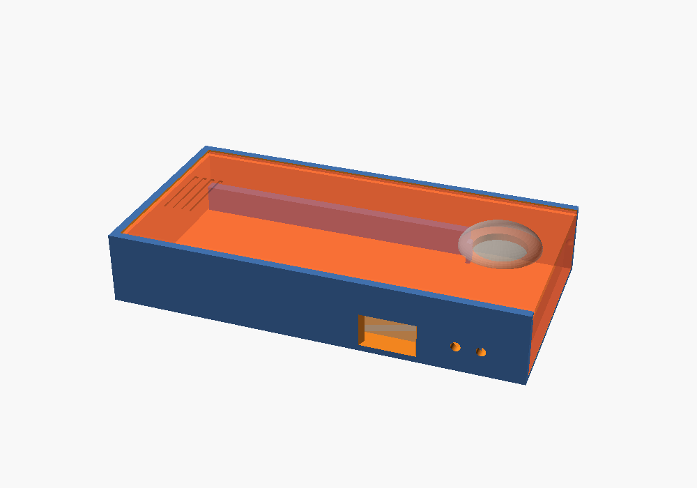
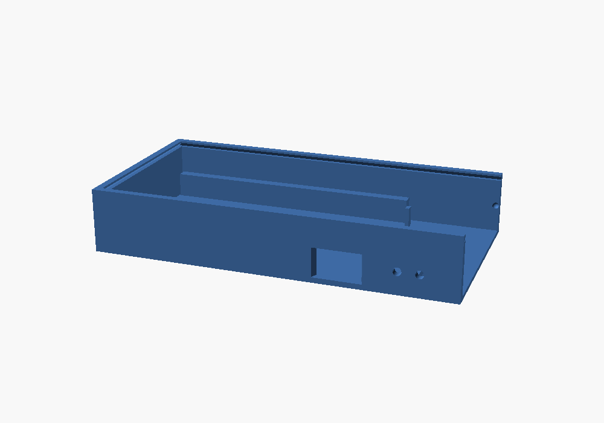
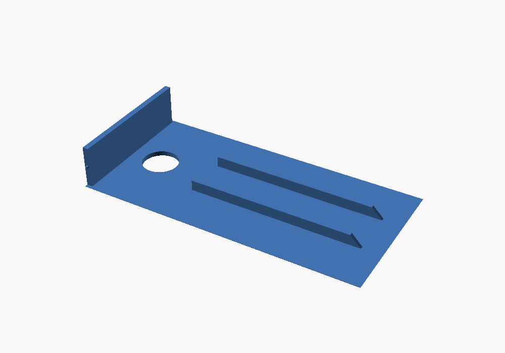

# Battery + Push-Button Housing

A two-part 3D-printable box (base + sliding lid, no screws) that holds:

- 1 × **QTEATAK 8 × AA battery holder** (with cover and ON/OFF switch)
- 1 × **SMLBJUTE 22 mm red mushroom-head momentary push button** (1NO, SPST)

Two output wires leave the box through the side wall. An internal zip-tie anchor gives them strain relief. A window in the side wall lets you reach the battery holder's own ON/OFF switch from outside.





## How the lid works

The lid slides on and off from the **button end**, like a pencil box:

- Its long edges ride in 45° grooves at the top of the side walls, and its far edge tucks under the end wall by the switch window. That holds the lid down without screws.
- The button end of the base is open. The lid carries that end wall with it, so the button (hanging under the lid) slides straight out of its compartment with the lid. Nothing in the base is in its way.
- Small bumps on that end wall click into dimples in the side walls when the lid is fully closed, so it doesn't slide open by itself.
- To open: push on the grip grooves at the far end of the lid with your thumb, or just pull on the button head.



## Files

| File | What |
|---|---|
| `button_box.scad` | Parametric OpenSCAD source. Edit the dimensions at the top. |
| `base.stl` | Ready-to-slice base, built from the default dimensions. |
| `lid.stl` | Ready-to-slice lid, already flipped top-face-down for printing (end wall pointing up). |

## Dimensions

The battery holder was measured at **126 × 71 × 19 mm** (L × W × H, cover on). The button reaches about 20 mm below its nut (the model allows 24 mm, for the wire bend). The switch position is still an estimate. To change any of them, edit these values at the top of `button_box.scad` and re-export:

- `holder_l`, `holder_w`, `holder_h`: battery holder size, including its cover
- `btn_body_d`: widest part of the button below the panel (nut across the corners)
- `btn_depth`: how far the button sticks down below the panel, including the terminals and wire bends
- `wire_d`: exit hole size (4 mm suits 18–22 AWG hook-up wire)
- `sw_from_end`, `sw_from_bottom`, `lead_from_end`: the holder's ON/OFF switch and lead wires are on the same long side. Lay the holder flat with that side facing you. From the end nearest the switch, measure to the switch center (`sw_from_end`) and to where the wires come out (`lead_from_end`). Measure from the table up to the switch center (`sw_from_bottom`). Set `switch_window = false` to leave the window out.
- `sw_gap`: room between that side of the holder and the wall, for the switch and the wires to bend (6 mm).

To re-export: `openscad -D 'part="base"' -o base.stl button_box.scad` (repeat with `lid`), or open the file in OpenSCAD, set `part`, press F6, then F7.

In the slicer the parts measure:

| Part | X | Y | Z |
|---|---|---|---|
| Base | 175.8 | 90.8 | 31.0 |
| Lid (as printed) | 173.8 | 86.8 | 28.7 |

Both fit the K1 SE's 220 × 220 mm bed. For other holder sizes (sliding lid, button depth 24): base X = L + 49.8, Y = W + 19.8, Z = max(H, 24) + 7; lid X = L + 47.8, Y = W + 15.8, Z = max(H, 24) + 4.7.

**Want the screw-on lid back?** Set `lid_style = "screw"` at the top of `button_box.scad` and re-export both parts. Print the base and the lid as two separate jobs, or put both on one plate.

## Print settings (Creality K1 SE / Creality Print)

- Material: PETG (tougher) or PLA
- Layer height: 0.2 mm
- Walls: 4 or more, top/bottom layers: 5
- Infill: 20 % gyroid
- **Supports: none needed.** The wire holes are small and bridge cleanly.
- Base: open side up. Lid: as exported (smooth top face on the bed, end wall pointing up).
- The lid's grooves overhang at 45°, which prints cleanly without supports.

## Hardware

- None for the lid.
- 1 × small zip tie (3–5 mm wide)
- Optional: 4 stick-on rubber feet

## Wiring

```
Battery holder RED (+12 V) ──► Button terminal 1
Button terminal 2 ──────────► Output wire 1  (+, switched)
Battery holder BLACK (−) ───► Output wire 2  (−)
```

**Leave slack:** the button rides on the lid, so give the wires to the button about **10 cm of slack**. That lets you slide the lid off and set it beside the box while you change batteries.

1. Put the battery holder in the main cavity with its **switch-and-wires side facing the wall with the switch window and the output wire holes**, and the switch end toward the button compartment. Push it against the stops at the compartment end; the switch then lines up with the window. The spacer on that side stops short of where the leads come out, so the switch and the leads have a 6 mm gap. Run the leads along that gap into the button compartment, where all the connections are made.
2. Push the button through the lid hole from the top. Tighten the nut from underneath.
3. Wire it as shown above, leaving the slack. Solder or crimp, and cover the joints with heat-shrink.
4. Feed the two output wires out through the side holes. Zip-tie them to the anchor bridge just inside the holes. (The tie goes through the tunnel under the bridge and over the wires.)
5. The holder's ON/OFF switch, reached through the side-wall window (use a fingertip or a pen), is your master power switch. Turn it OFF for storage or transport so the button can't fire if it gets bumped.
6. Tuck the slack wire into the button compartment. Slide the lid on from the button end, with the button going in first, until it clicks. The ribs under the lid have sloped ends, so they ride over the holder and then press it down so it doesn't rattle.

To change the batteries, slide the lid off toward the button end, lift out the holder, and slide off its cover.

## Notes

- The button is rated 3–5 A. Eight AA cells give a nominal 12 V.
- If the lid slides too tight, raise `slide_clr` (0.4 → 0.5). If it's loose, lower it. If the click is too hard or too soft, change `detent` (0 turns it off). A little sanding works too.
- If the lid ribs press too hard on the holder (or not hard enough), increase or decrease `holder_h` by about 0.5 mm.
