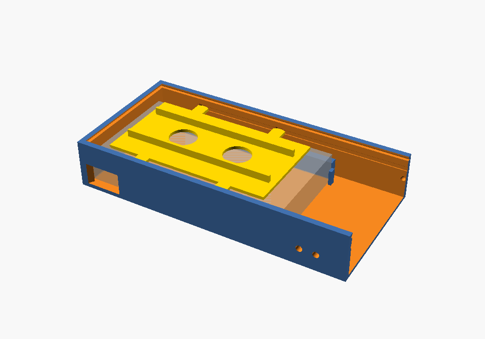

# Battery + Push-Button Housing

A two-part 3D-printable box (base + sliding lid, no screws) that holds:

- 1 × **QTEATAK 8 × AA battery holder** (with cover and ON/OFF switch)
- 1 × **SMLBJUTE 22 mm red mushroom-head momentary push button** (1NO, SPST)

Two output wires leave the box through the side wall. An internal zip-tie anchor gives them strain relief. A window in the side wall lets you reach the battery holder's own ON/OFF switch from outside.


## How the lid works

The lid slides on and off from the **button end**, like a pencil box:

- Its long edges ride in 45° grooves at the top of the side walls, and its far edge tucks under the closed end wall. That holds the lid down without screws.
- The button end of the base is open. The lid carries that end wall with it, so the button (hanging under the lid) slides straight out of its compartment with the lid. Nothing in the base is in its way.
- Small bumps on that end wall click into dimples in the side walls when the lid is fully closed, so it doesn't slide open by itself.
- To open: push on the grip grooves at the far end of the lid with your thumb, or just pull on the button head.


## Hold-down plate

A flat plate sits directly on top of the battery holder and keeps it from moving.

- It covers about **70%** of the holder's top. The switch-and-wires side and the button end are left uncovered, so the wires get out freely.
- **What holds it:** two ribs on top of the plate reach to within 0.2 mm of the main lid. With the lid on, the plate (and the holder under it) can't lift. Friction alone tends to loosen as printed plastic wears, so the lid does the real holding.
- **Snap tabs:** four snap tabs, two per side, hold the plate in place. Each is a small pointed bump on a thin flexible strip (30 mm long, 1.2 mm thick) that runs alongside the wall and is attached to the plate at both ends. The bumps ride in shallow tracks (0.6 mm deep) in both side walls, with the strips bent in 0.4 mm. When the plate is fully in, each bump springs out into a deeper pocket (1.1 mm) with a **snap**. The tracks also keep the plate from lifting while the main lid is off. The bumps and pockets have 45° sloped ends, so a firm pull snaps the plate back out.


- **Putting it in:** slide it in flat from the open (button) end, riding on top of the holder, until the tabs snap into their pockets, about 6 mm short of the far wall. It can't be dropped in from above, because the main lid's grooves make the top opening too narrow. Its front edge and the tabs are tapered so it eases in, and the tabs follow the tracks in the walls.
- **Taking it out:** hook a finger in one of the two holes and slide it back out the button end.



## Files

| File | What |
|---|---|
| `button_box.scad` | Parametric OpenSCAD source. Edit the dimensions at the top. |
| `base.stl` | Ready-to-slice base. The switch window is sized from the measured switch (see below). |
| `lid.stl` | Ready-to-slice lid, already flipped top-face-down for printing (end wall pointing up). |
| `plate.stl` | Hold-down plate that sits on top of the battery holder. Print flat, ribs up. |

## Dimensions

The battery holder was measured at **126 × 71 × 19 mm** (L × W × H, cover on). The button reaches about 20 mm below its nut (the model allows 24 mm, for the wire bend). The switch position is still an estimate. To change any of them, edit these values at the top of `button_box.scad` and re-export:

- `holder_l`, `holder_w`, `holder_h`: battery holder size, including its cover
- `btn_body_d`: widest part of the button below the panel (nut across the corners)
- `btn_depth`: how far the button sticks down below the panel, including the terminals and wire bends
- `wire_d`: exit hole size (4 mm suits 18–22 AWG hook-up wire)
- Switch (measured on the real holder, lying cover-side up with the switch side facing you; the slider moves left/right, left = ON, right = OFF): it spans 8–16 mm from the holder's switch end (`sw_x0`, `sw_x1` = 110 mm from the other end) and 6.5–12.5 mm up (`sw_z0`, `sw_z1` = 6.5 mm below the top). The knob is 3 × 3 mm and sticks out 2 mm. The window is the switch plus a buffer so the printed ON/OFF labels beside it show: 6 mm left and right (`sw_buffer_h`) and 3 mm above and below (`sw_buffer_v`), giving 20 × 12 mm at the holder, widening toward the outside. Set `switch_window = false` to leave the window out.
- `lead_from_end`: from the other end of the holder to where the wires come out.
- `sw_gap`: gap between that side of the holder and the wall (2 mm, so the switch is easy to reach).
- `lead_pocket_d`, `lead_pocket_h`: the pocket cut into the inside of the wall at the holder's wires (2.4 mm deep, 16 mm tall). It doesn't go through to the outside.

To re-export: `openscad -D 'part="base"' -o base.stl button_box.scad` (repeat with `lid`), or open the file in OpenSCAD, set `part`, press F6, then F7.

In the slicer the parts measure:

| Part | X | Y | Z |
|---|---|---|---|
| Base | 175.8 | 86.8 | 31.0 |
| Lid (as printed) | 173.8 | 82.8 | 28.7 |
| Hold-down plate | 106.5 | 81.6 | 6.8 |

Both fit the K1 SE's 220 × 220 mm bed. For other holder sizes (sliding lid, button depth 24): base X = L + 49.8, Y = W + 15.8, Z = max(H, 24) + 7; lid X = L + 47.8, Y = W + 11.8, Z = max(H, 24) + 4.7.

**Want the screw-on lid back?** Set `lid_style = "screw"` at the top of `button_box.scad` and re-export both parts. Print the base and the lid as two separate jobs, or put both on one plate.

## Print settings (Creality K1 SE / Creality Print)

- Material: PETG (tougher) or PLA
- Layer height: 0.2 mm
- Walls: 4 or more, top/bottom layers: 5
- Infill: 20 % gyroid
- **Supports: none needed.** The wire holes are small and bridge cleanly.
- Base: open side up. Lid: as exported (smooth top face on the bed, end wall pointing up).
- The lid's grooves overhang at 45°, which prints cleanly without supports.

## Hardware

- None for the lid.
- 1 × small zip tie (3–5 mm wide)
- Optional: 4 stick-on rubber feet

## Wiring

```
Battery holder RED (+12 V) ──► Button terminal 1
Button terminal 2 ──────────► Output wire 1  (+, switched)
Battery holder BLACK (−) ───► Output wire 2  (−)
```

**Leave slack:** the button rides on the lid, so give the wires to the button about **10 cm of slack**. That lets you slide the lid off and set it beside the box while you change batteries.

1. Put the battery holder in the main cavity with its **switch-and-wires side facing the wall with the switch window and the output wire holes**. **Easy check:** stand on the switch-window side of the box and the word **OPEN** on the holder's cover should read upright to you; the bottom edge of that word points at the switch-and-wires side. The switch goes at the far end (by the window), the wires at the button-compartment end. Push it against the stops at the compartment end; the switch then lines up with the window. Where the wires come out, a pocket cut into the inside of the wall gives them room, so they aren't crushed against the wall. The pocket runs straight into the button compartment, where all the connections are made.
2. Push the button through the lid hole from the top. Tighten the nut from underneath.
3. Wire it as shown above, leaving the slack. Solder or crimp, and cover the joints with heat-shrink.
4. Feed the two output wires out through the side holes. Zip-tie them to the anchor bridge just inside the holes. (The tie goes through the tunnel under the bridge and over the wires.)
5. The holder's ON/OFF switch, reached through the side-wall window (use a fingertip or a pen), is your master power switch. Turn it OFF for storage or transport so the button can't fire if it gets bumped.
6. Slide the hold-down plate in flat from the button end, on top of the battery holder, ribs up.
7. Tuck the slack wire into the button compartment. Slide the lid on from the button end, with the button going in first, until it clicks.

To change the batteries, slide the lid off toward the button end, slide the hold-down plate out by its finger holes, lift out the holder, and slide off its cover.

## Notes

- The button is rated 3–5 A. Eight AA cells give a nominal 12 V.
- If the lid slides too tight, raise `slide_clr` (0.4 → 0.5). If it's loose, lower it. If the click is too hard or too soft, change `detent` (0 turns it off). A little sanding works too.
- If the snap is too hard, lower `snap_d` (0.4 → 0.3) or make the strips thinner (`spring_t` 1.2 → 1.0). If it's too soft, raise `snap_d` to 0.5. PETG handles repeated snapping better than PLA.
- If the holder still moves with the lid on, lower `lid_gap` (0.2 → 0). The ribs then press the plate down when the lid is closed.
- To go back to ribs under the lid instead of the plate, set `hold_plate = false`.
